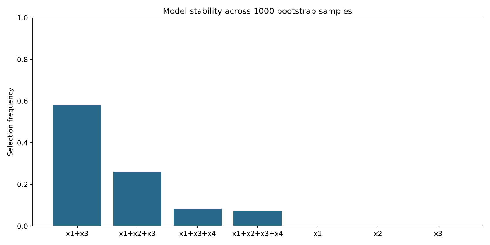

# Model Selection and Bootstrap Stability Lab

Compare all 15 nonempty subsets of four predictors using AIC, AICc and BIC, then test how often models win under 1,000 bootstrap resamples.



## Project provenance

Inspired by my undergraduate model-selection study at McGill, where I compared predictor subsets and bootstrap stability in R. This repository is a new Python demonstration on synthetic data; it does not reproduce the original five case studies or claim their results.

This portfolio starter was prepared with AI assistance. I will review, run and adapt the code before presenting it as my work. It is a personal learning project, not production software or evidence of an employer deployment.

## Business or research question

Compare all 15 nonempty subsets of four predictors using AIC, AICc and BIC, then test how often models win under 1,000 bootstrap resamples. The goal is to make assumptions and uncertainty visible rather than only produce a chart.

## Run locally

Requires Python 3.10 or later. From this repository folder:

```bash
python3 -m venv .venv
source .venv/bin/activate
python -m pip install -r requirements.txt
python main.py
python -m unittest discover -s tests -v
```

Windows: use `.venv\\Scripts\\activate` instead of the source command. No API key, account or network data request is used by the analysis. Package installation requires internet access. CSVs and PNGs in `outputs/` are already included so you can inspect the results without installing anything.

## Approach

1. Generate 180 synthetic observations, including a correlated predictor and a noise predictor.
2. Split into 120 training rows and 60 holdout rows before fitting.
3. Fit OLS for every nonempty subset; count the intercept and variance parameter in information criteria.
4. Resample training rows 1,000 times and compare AICc/BIC selection frequencies.
5. Evaluate training-selected models and AIC-weighted predictions on the untouched holdout.

## Outputs

- `outputs/model_comparison.csv`: IC scores, weights, holdout RMSE and bootstrap frequencies.
- `outputs/synthetic_data.csv`: generated observations with train/test labels.
- `outputs/results.md`: exact run settings and findings.

## Findings

Read [the generated results](outputs/results.md) and inspect the CSVs. All numbers describe this synthetic run. They are not measured business improvements. Re-run `python main.py` to regenerate the committed outputs.

## Quality checks

The included tests check core numerical or data-quality invariants. GitHub Actions runs them automatically on pushes using Python 3.11. Tests do not establish production readiness or validate real-world predictive performance.

## Limits and next steps

This is one simulation seed, not proof that one criterion is always best. Bootstrap rows assume independent observations. Linear/Gaussian assumptions, collinearity and sample size influence selection. Nonempty subsets exclude the intercept-only model. A stronger extension would add additional seeds, a null model and a time-series resampling scheme.

## What I should be able to explain

- What data was generated and why it is appropriate for a demonstration.
- The purpose of each main function and how the outputs are calculated.
- One meaningful assumption, one failure case and one extension I implemented myself.

Suggested GitHub topics: python, statistics, regression, bootstrap, model-selection.

## Interview introduction

> I created a Python companion to my model-selection research to explore how stable a selected regression model is under resampling. I used synthetic data and kept the holdout separate from model selection.

Use this introduction after reviewing the code and completing a modification. Describe the repository as a new personal project inspired by earlier experience.

